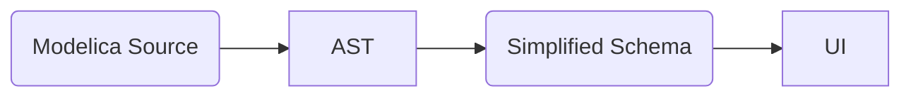
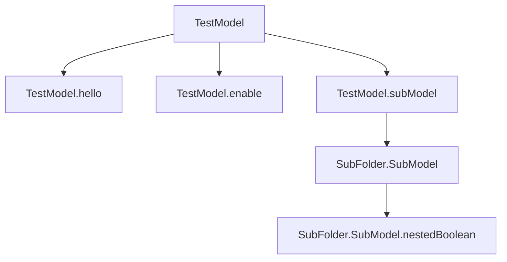
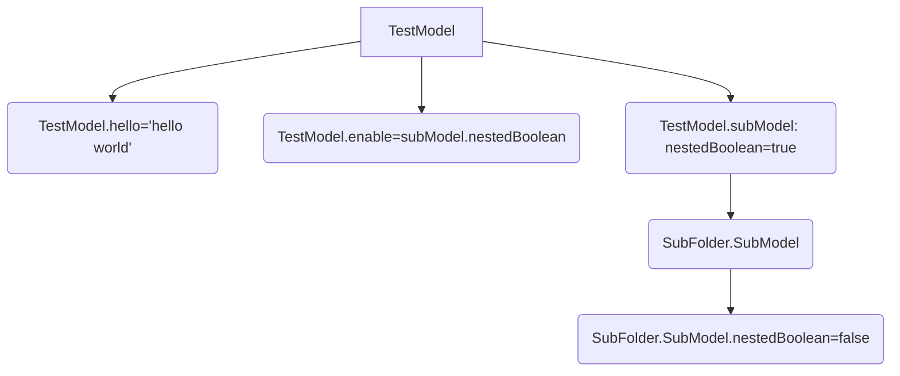

<!-- @format -->

# Writing a Modelica Interpreter: How mind-numbing complexity forced us to use simple design patterns

## Why should anyone care?

Anyone who's written a Domain-specific language ([DSL](https://en.wikipedia.org/wiki/Domain-specific_language)) or found themselves accidentally entrenched in a [shotgun parser](https://stackoverflow.com/questions/50852226/what-does-shotgun-parser-mean/50852772#50852772) knows the pains involved in processing a grammar. We found ourselves needing to take a predefined Abstract Syntax Tree (AST) and generate a UI from it. The pain we experienced along the way forced us into a disciplined simplicity from which some pretty useful design patterns emerged. In this blog post, we share the lessons we learned from situations where mind-numbing complexity led us into a set of simple patterns.

## So, What's Modelica?

Modelica is a class-based language for describing mathematical behavior. Those classes can be composed to create models, and in turn, those models can then be used to simulate the behavior of systems. In our case, we were simulating HVAC systems.

In addition, Modelica is useful across many other engineering disciplines. A key feature of Modelica is that it allows the user to adjust parameters without rewriting code.

Modelica does not have a UI, but through interpretation of its annotation system, we can programmatically generate one.

## Our Task

Below is a Modelica model with two parameters, `hello` and `allow_hello`. `hello` as an input needs to be conditionally enabled based on the expression: `allow_hello == true`

```modelica
within ExamplePackage;
  model TestModel "Test Model"
    parameter String hello="World"
      "Hello"
      annotation (Dialog(enable=allow_hello == true));
    parameter Boolean allow_hello=true
      "Enable";
    parameter SubModelA subModel
      "A model with its own list of parameters";
end TestModel;
```

From this Modelica model, we are provided with a custom AST representation. We received the model in an AST format (written in JSON) so it could be [serialized](https://en.wikipedia.org/wiki/Serialization) and sent over the wire to the UI.

In other words, we need to go from this:

```json
{
    "within": "ExamplePackage",
    "class_definition": [
      {
        "class_prefixes": "model",
        "class_specifier": {
          "long_class_specifier": {
            "identifier": "HelloModel",
            "description_string": "Test Model",
            "composition": {
              "element_list": [
                {
                  "component_clause": {
                    "type_prefix": "parameter",
                    "type_specifier": "String",
                    "component_list": [
                      {
                        "declaration": {
                          "identifier": "hello",
                          "modification": {
                            "equal": true,
                            "expression": {
                              "simple_expression": "\"World\""
                            }
                          }
                        },
// ...
```

To this:


Labels, data types, and initial values seemed relatively simple, but the input 'hello' is conditionally enabled based on the expression:

`allow_hello == true`

This means we need to be able to resolve variables, and resolving variables means we have to understand scope, assignments, and much more. It's a hard problem.

## Compressing the Problem: Parsing the AST to a Simplified Format

Ultimately, we want to arrive at a more simplified representation of the AST that only contains the parameters we care about. Something like the following:

```json
{
  "nodes": [
    {
      "path": "TestModel.hello",
      "type": "String",
      "value": "Hello World",
      "enable": {
        "operator": "==",
        "operands": ["TestModel.allow_hello", true]
      },
      "childNodes": []
    },
    {
      "path": "TestModel.allow_hello",
      "type": "boolean",
      "value": "true",
      "enable": "true",
      "childNodes": []
    }
  ]
}
```

Ultimately, the flow of information will be as follows:



## Generating a Simplified Structure from a (deeply-nested) AST (“THE PARSER”)

Given that we're provided with the AST, our first task is to create a simplified and flat schema structure that can be easily interpreted within a browser to display the UI.

When the parser finds a new type, the AST representation is mapped to the simplified schema. The user-facing text, initial value, type, and enable/disable behavior are extracted into a mostly flat structure.

This map allows us to greatly reduce the amount of data needed. The AST representation of the models was around 40MB while the simplified format was closer to 4MB.

### Removing Implicit Imports and Simplifying Type References

The parser steps through the AST and, as types and parameters are discovered, it inserts that type and its simplified representation into a [dictionary](https://en.wikipedia.org/wiki/Associative_array).

```typescript
{
    {[key: string]: SimplifiedDataType} // 'key' is the absolute path
}
```

In our 'Hello World' example, we find the `String` and `boolean` primitive types. Classes can also be assigned to parameters, e.g. `SubFolder.MyCustomClass`. Modelica has multiple implicit strategies for finding type definitions. For example, `SubFolder.MyCustomClass` could imply that `MyCustomClass` is defined in a file located at `./SubFolder/MyCustomClass.mo`. The parser implements these rules, finds the appropriate file, and parses the definition into the dictionary. This dictionary can be easily serialized into a single file, with the previous file tree being flattened into keys, e.g. `./SubFolder/MyCustomClass.mo` becomes `SubFolder.MyCustomClass`.

### Creating a Tree Representation: Making Relations Explicit

The AST references different types without direct links. The parser extracts these types into a flat, easily accessible dictionary of types. The components that make up a class definition are explicitly connected through the attribute 'children', a list of absolute paths referencing other types in the dictionary of types.

When iterating through a class definition, the parser builds up a tree of relationships between parameters and types.

Expanding on the original `TestModel`:

```modelica
within ExamplePackage;
  model TestModel "Test Model"
    parameter String hello="World"
      "Hello"
      annotation (Dialog(enable=allow_hello == true));
    parameter Boolean allow_hello=subModel.nestedBoolean
      "Enable";
    parameter SubFolder.SubModel subModel(nestedBoolean=true)
      "A model with its own list of parameters";
end TestModel;
```

The parameter `subModel` has been added with a type `SubFolder.SubModel`. A child parameter of SubModel `nestedParameter` has been assigned `false` and the value of `allow_hello` is now an assignment from the instance value `subModel.nestedBoolean`.

After iterating through the parameter list, the dictionary of simplified types looks like this:

```json
{
  "TestModel.hello": { "type": "String" },
  "TestModel.enable": { "type": "Boolean" },
  "TestModel.subModel": { "type": "SubFolder.SubModel" }, // <--
  "SubFolder.SubModel": {
    "type": "SubFolder.SubModel",
    "children": ["SubFolder.SubModel.nestedParam"]
  }, // <-- SubModel class definition
  "SubFolder.SubModel.nestedBoolean": { "type": "String" } // <-- nested param defined in SubModel
}
```

This allows us to follow the related types from the `children` of `TestModel` to build a tree that looks as shown below:



Notice that there are parameters (like TestModel.subModel) and definitions (like SubFolder.SubModel) mixed together. I'll discuss more about this later.

This data structure is helpful for understanding the structure of a given class. No implicit behavior around importing files or class relationships is required to understand the structure of `TestModel`.

### And More

There are additional features that were also parsed and simplified but we will not cover here, including:

- Handling dependency injection in Modelica
- Fitting within the simplified schema the polymorphic behavior that enabled swapping types (imagine a system that allows for selecting a branch to traverse)
- Formatting assigned values (right-hand-side values) into a common shape
- Inheritance was flattened

We didn't need expressive, flexible grammar to get to the features we needed for the UI. The parser simplifies the AST representation into a more explicit, less flexible tree representation that worked for our purpose. Less variability and implicit behavior meant simpler algorithms for interpretation on the front end.

## Writing an Interpreter

With our simple grammar in place, we can return to the original expression we were attempting to resolve:

```typescript
allow_hello == true;
```

To resolve this, a few things needed to be understood:

1. How do you evaluate the operator (`==`) and it's operands (`allow_hello`, `true`)
1. How do you get the value of `allow_hello`
1. How do you incorporate user input to determine the value of `allow_hello`

### Evaluating Expressions (without variables)

Before attempting to solve an expression with variables, we have to deal with the basics of evaluation with constants and operators. How do you handle different operators? How do you deal with expressions like `3 < 5`, `true && (3 < 4 || 2 > 1)`?

We came up with a schema that looked like this:

```typescript
export type Expression = {
  operator: string;
  operands: Array<Literal | Expression>;
};
```

This type of structure allows for relatively simple evaluation function:

```typescript
function evaluate(expression: Expression) {
  switch(expression.operator) {
    case '<': {
	    // reduce the list of operands into a single value
      const accumulator;
      expression.operands.forEach(operand => {
        if (isExpression(operand)) {
          operand = evaluate(operand); // recursive call
        }
        // operator specific reduction with the accumulator
        operatorReduction(accumulator, operand);
      });

      return accumulator;
    }
}
```

Each operator (e.g. `<`, `==`, etc.) can be separated into a case in the switch statement.

Nested expressions could be handled by making a recursive call.

### Resolving Variables

With the basics of evaluation in place, we can now address variable resolution.

Like before, there was a goal in mind for what variable resolution would look like:

```typescript
const context = new Context(userSelections, testModel);
context.getValue(`allow_hello`); // returns 'true'
```

A model should be able to be loaded (`testModel`) with a class constructor (`Context`), and the created 'context' instance should then be queryable like entering variable names in a REPL.

With that in mind, we now have to figure out how to determine the initial values of `testModel`.

Returning to the tree view of TestModel, if we add the initial value to each node we get the following:



What this view captures is the tree of dependencies that make up our dictionary of variable names and their values. If TestModel is loaded, the following variables and values should be collected in a dictionary that represents our current scope.

```typescript
{
    "hello": "hello world",
    "enable": true,
    "subModel.nestedBoolean": true
}
```

Notice that the keys in scope do not match the original node identifiers. Instead we are using 'instance paths'. Instance paths are formed by appending parameter names together. Why use instance paths? Types like `SubFolder.Submodel` can be reused but the instance paths 'subModel.nestedBoolean' is unique.

Notice as well that the value 'subModel.nestedBoolean' resolves to `true` even though the node 'SubFolder.SubModel.nestedBoolean' sets the same instance path to `false`. The 'SubFolder.SubModel.nestedBoolean' node represents the original definition of the class parameter. The 'TestModel.subModel' node is the instance that includes an override of the original value of 'nestedBoolean'. Overrides must take precedent over the downstream definition.

This behavior can be implemented using a [pre-order tree traversal](https://en.wikipedia.org/wiki/Tree_traversal#Pre-order,_NLR). This is a depth-first algorithm that processes the current node before visiting child nodes. In this example, that means getting the values assigned by the node `TestModel.subModel` before visiting the child node `SubFolder.SubModel.nestedBoolean`.

### And More

The logic around tree traversal and the process of building up 'scope' was slightly more complicated.

- We ignored class definitions when building instance paths. As part of that we had to indicate in the simple schema what nodes were class definitions
- Child node traversal was dependency driven. When a variable was found that was not in the scope dictionary, we find the branch that it does exist on and traverse that first.

### Generating UI and Incorporating User Input

With variables resolved and expressions evaluated, UI can now be generated.

We need to map from parameter values and types to a UI component. If the parameter is of type boolean, we need a checkbox component, if it is an enum we need a dropdown.

Like before, a pre-order tree traversal was used to visit each node of the template. This time, child nodes could be visited in order as all nodes were populated with a value. No need to worry about dependency-driven loading.

The same string-building logic that was used to build up an instance path was also used to label and identify the corresponding UI. On user input, the value is stored using that instance path. As the user makes selections, a mirror object to the variables dictionary is built up using those instance path keys.

Because the inputs used the same variable instance names, incorporating these selections into the concept of 'context' was straightforward. When resolving a variable value, always check what's in the selection dictionary before going to the variables dictionary.

### Arrival

We have arrived! We can now resolve the expression:

```typescript
allow_hello == true;
```

Templates provided as an expansive AST are converted to a paired down 'simple schema' that strips away extraneous detail and features of the Modelica language.

We are able to understand both what to do with the operator ('==') and operands ('allow_hello' and 'true')

The simple schema can be interpreted to generate all variables and definitions currently in scope, through which the operand 'allow_hello' can be boiled down to an actual value and enable/disable UI based on the


## General Tips for Reducing Complexity

### Use Best Practices to Think in Terms of Interfaces, not Implementation

They’re best practices for a reason, and using them allows you to spend less time wading through implementation details. Some I’d like to highlight:

Single purpose classes and functions: identify the concept/action/behavior you're trying to encapsulate and make sure your class/function sticks to it.
Modify state deliberately in well known parts of code. Rely on pure functions as much as possible to keep the non-deterministic harder-to-test portions of code limited.
Use types in weakly typed languages

Consistency around these practices allows for predictability. With predictability you can understand more about what a function does just by its signature.

### Nurture the Mental Model

Find a simplified representation to underpin understanding of something complex. A mental model is the internal representation of a problem in your head, and it should be a clarifying force: terse enough to be quick to reason about but accurate enough that it can be used as a heuristic for implementation details. A good way to test the effectiveness of your mental model is to describe it to someone else who is unfamiliar with the project.

Also, take time with the actual language used in the project, both for variable naming and general descriptions. What is the difference between ‘name’ and ‘id’? When do I use the term ‘node’ vs. ‘parameter’ vs. ‘input’? A shared understanding of these terms provide an implicit hint on implementation and usage.

Conversely, the wrong terms can be a near constant source of obfuscation, tripping up discussions and interjecting confusion.

### Testing Offloads Thinking

Tests offload thinking by allowing your code contracts and corner cases to be enshrined in nice re-runnable tests. When implementing some new behavior, you can primarily focus on that specific feature, without the background noise of special cases.

Tests are also a good way to keep your headspace thinking in terms of interfaces. Tests are clients of the code you are writing, so you immediately test out the interface you are establishing. Additionally, when an interface needs to be changed, you get to double check that change by updating the appropriate test.

A good test suite allows you to take bigger risks with your code.

### Set Up Your Code for Play

Make it easy to ‘play’ with your code. A combination of fast tests, quick validation cycles, and sound strategies for reverting a commit can provide a degree of safety that allows for play.

Tests that can quickly run on change can help course correct an implementation strategy.

Having a fast validation cycle (time from code change to result) also allows for fast course corrections. If you are using a weak typed language use the types for clearly defined interfaces. Most editors provide instantaneous feedback on whether or not your new code works.

And in git, make commits with the revert in mind. Like functions or classes, encapsulate the functional change the commit includes. Then if you do have to revert, you can cleanly remove work around one feature without having to revert something unrelated.

All of this is working towards a frictionless, safe development environment. A feeling of safety is important for creativity, and creativity is definitely needed when working through hard problems.
